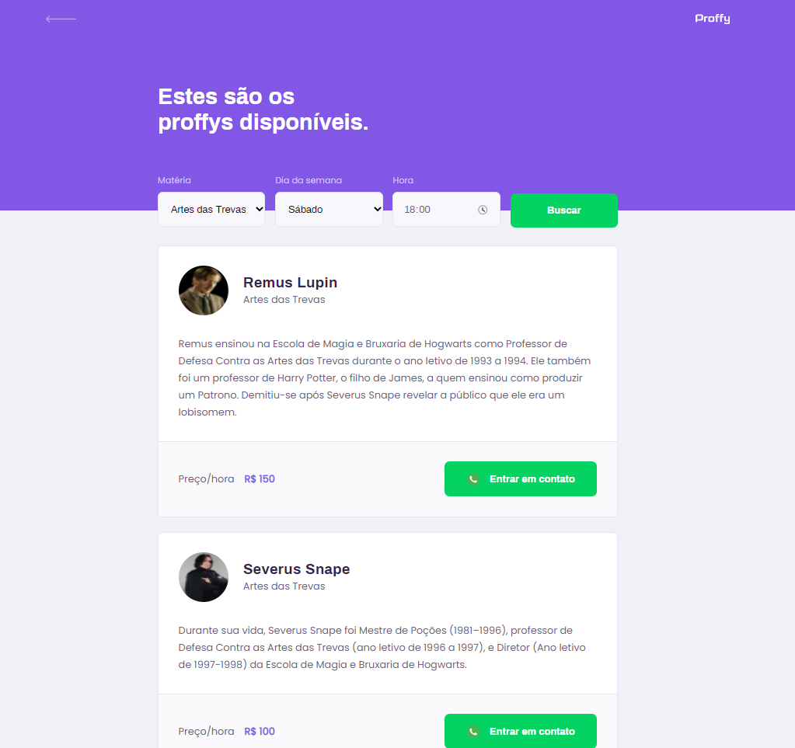

<h1 align="center">
    Proffy
</h1>

 

 <h1 align="center">Mobile version</h1>
 

    
 

 <h1 align="center">Web version</h1>
 

    
    
 

## 💻 Projeto

Proffy é uma plataforma que facilita a conexão entre alunos e professores. 

Projeto mobile e web desenvolvido dentro do evento Next Level Week #2, disponibilizado pela Rocketseat.

## 🚀 Tecnologias

Desenvolvido com as seguintes tecnologias:

- [Node.js](https://nodejs.org/en/)
- [React](https://reactjs.org)
- [React Native](https://facebook.github.io/react-native/)
- [Expo](https://expo.io/)

## :memo: Licença

Esse projeto está sob a licença MIT. Veja o arquivo [LICENSE](LICENSE.md) para mais detalhes.

---
Projeto desenvolvido com a tutoria de [Diego Fernandes](https://github.com/diego3g)
